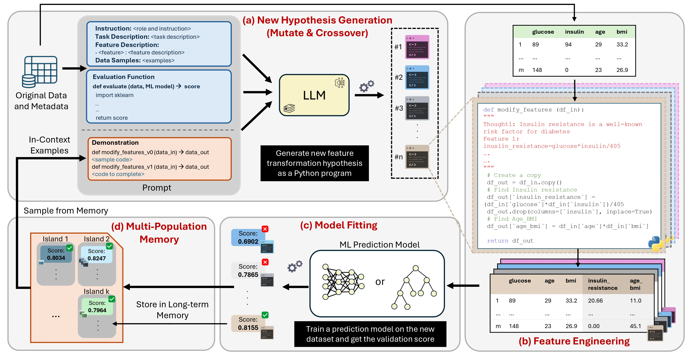

# EvoFeat



An evolutionary search loop where LLMs propose Python feature-transform functions, a downstream classifier scores them, and the winners feed back into the next prompt. Four model families compete head-to-head against seven classical feature-engineering baselines on Banking77 intent classification.

The codebase is small on purpose — one package (`evofeat/`), four entry-point scripts, no orchestration framework.

## What's in here

| | |
|--|--|
| **Task** | 77-class intent classification on banking customer queries (PolyAI/banking77) |
| **Base features** | 12 lexical + 5 spaCy NER + 50 TF-IDF columns derived from the raw query text |
| **Search algorithm** | Island-based evolutionary loop (3 islands, 3 candidates / prompt, ~20 prompt iterations, early stop on no-improve) |
| **LLM backbones** | `openai/gpt-oss-20b` and `llama-3.1-8b-instant` via Groq API; `Qwen2.5-7B`, `Mistral-7B-Instruct-v0.3`, `Llama-3.1-8B-Instruct` via vLLM (Colab notebook) |
| **Downstream models** | XGBoost, Logistic Regression, Random Forest — every feature set gets all three |
| **Classical baselines** | Fisher score, ANOVA F, Mutual Information, Lasso L1, Variance Threshold, RFE+XGBoost, PolynomialFeatures, and a combined VarThresh→MI pipeline |
| **Statistical comparison** | Paired t-tests + Wilcoxon signed-rank + bootstrap 95% CI + Cohen's d, with Bonferroni correction across all pairs |
| **Interpretability** | SHAP TreeExplainer on the best program per backbone; top-k feature attribution with rule-based rationales |
| **Cost tracking** | Per-backbone token / latency accounting → Pareto frontier of accuracy vs USD |

## Layout

```
EvoFeat/
├── evofeat/
│   ├── llm.py              # Groq / vLLM clients behind a single BaseClient
│   ├── search.py           # island-based evolutionary search
│   ├── buffer.py           # cluster-of-programs experience buffer
│   ├── sandbox.py          # subprocess-isolated candidate executor
│   ├── codegen.py          # AST-aware program parsing / rewriting
│   ├── prompts.py          # prompt templates + feature/example blocks
│   ├── evaluate.py         # 5-fold CV across XGB / LogReg / RF
│   ├── preprocess.py       # categorical encoding + NaN/Inf cleanup
│   ├── data.py             # dataset loaders (banking77 + UCI csv)
│   ├── llm_builder.py      # turn a saved LLM program into a FeatureBuilder
│   ├── baselines/          # the seven classical-FE comparators
│   ├── stats.py            # paired t + Wilcoxon + bootstrap CI + Cohen's d
│   ├── shap_analysis.py    # SHAP plots + top-k feature rationales
│   ├── cost.py             # token/$ accounting + Pareto table
│   ├── reporting.py        # csv/markdown/latex tables + plots
│   ├── logger.py           # wandb wrapper with offline jsonl fallback
│   └── datasets/banking77.py   # HF download + tabular feature extraction
├── configs/                # YAML per backbone + per experiment
├── specs/                  # per-dataset prompt templates + initial seeds
├── prompts/                # head/tail blocks spliced into prompts
├── scripts/                # run_evofeat / run_baselines / run_comparison / run_full_experiment.sh
├── notebooks/              # Colab/Kaggle GPU notebooks for vLLM-served backbones
├── tests/                  # pytest unit tests (sandbox, stats, baselines, llm_builder)
├── data/                   # raw UCI CSVs + banking77 parquet (built by the prep script)
└── results/                # generated tables + figures + per-run logs
```

## Quick start

```bash
# 1) install
python -m pip install -r requirements.txt
python -m spacy download en_core_web_sm

# 2) copy the env template, drop in a Groq key
cp .env.example .env
$EDITOR .env       # set GROQ_API_KEY

# 3) build banking77 features (downloads from huggingface, ~30s)
python -m evofeat.datasets.banking77 --build

# 4) run the whole pipeline end-to-end
bash scripts/run_full_experiment.sh
```

This produces `results/tables/headline.md`, `results/figures/comparison_bars.png`, `results/figures/pareto.png`, per-backbone SHAP plots under `results/shap/`, and a per-iteration JSONL log under `results/runs/`.

To run only the cloud backbones (no GPU box needed):

```bash
python scripts/run_evofeat.py \
    --experiment configs/experiments/banking77_full.yaml \
    --only gpt-oss-20b
```

To run a quick 30-evaluation smoke test:

```bash
python scripts/run_evofeat.py --quick
```

## vLLM-hosted backbones on a cloud GPU

The three local backbones are served with vLLM. Open
`notebooks/colab_vllm_run.ipynb` on Google Colab with an **L4 or A100**
runtime (vLLM's attention kernels need sm_80+; a T4 won't do), add a Colab
secret `GH_TOKEN` holding a GitHub PAT with `repo` scope, and run all cells.
The notebook will:

1. clone the repo into `/content/EvoFeat/`,
2. install vLLM,
3. for each of `Qwen/Qwen2.5-7B-Instruct`, `mistralai/Mistral-7B-Instruct-v0.3`, and `Meta-Llama-3.1-8B-Instruct` — spin up a vLLM OpenAI-compatible server on port 8000, run the search loop against it, tear the server down,
4. commit `results/runs/{backbone}/` back to the repo and push.

The Llama mirror (`NousResearch/...`) is un-gated, so no HF token is needed;
set an `HF_TOKEN` secret if you'd rather pull the official `meta-llama`
weights. After the push, re-run `scripts/run_comparison.py` locally to fold
the new backbones into the headline table.

## How the search works (one paragraph)

The buffer keeps three "islands" of program clusters. Each cluster is a set of programs with the same per-fold score signature; islands evolve independently but the weakest half resets every few hours, reseeded from the survivors. Each iteration: pick an island, draw `functions_per_prompt` programs softmax-weighted by cluster score, render them into the prompt template with the dataset metadata + a handful of sample rows + the previous best, ask the LLM for `samples_per_prompt` continuations, parse the function body out of each response, run it in a SIGALRM-guarded subprocess against the training fold, and feed back the resulting score (or the exception traceback) on the next round. A candidate that calls its own ancestor (e.g. `modify_features_v3` calling `modify_features_v2`) is rejected so the population can't smuggle prior work into a "new" program.

## Results

Banking77, 77-class accuracy under XGBoost, 5-fold stratified CV. Full table
in [results/tables/headline.md](results/tables/headline.md):

| method (feature set)        | accuracy (mean ± std) |
|-----------------------------|-----------------------|
| base (TF-IDF + lex + NER)   | 0.5810 ± 0.0063 |
| variance_thresh             | 0.5810 ± 0.0063 |
| **llm: gpt-oss-20b**        | **0.5806 ± 0.0071** |
| **llm: qwen-2.5-7b**        | **0.5805 ± 0.0096** |
| **llm: mistral-7b-v0.3**    | **0.5797 ± 0.0081** |
| **llm: llama-3.1-8b-instruct** | **0.5795 ± 0.0109** |
| llm: llama-3.1-8b-instant   | 0.5328 ± 0.0093 |
| lasso_l1                    | 0.4995 ± 0.0083 |
| mutual_info / combined      | 0.4994 ± 0.0121 |
| rfe_xgb                     | 0.4174 ± 0.0035 |
| fisher                      | 0.4171 ± 0.0064 |
| anova_f                     | 0.4166 ± 0.0071 |

Backbones: `gpt-oss-20b` and `llama-3.1-8b-instant` via Groq; `qwen-2.5-7b`,
`mistral-7b-v0.3`, `llama-3.1-8b-instruct` via vLLM on an L4.

**What the numbers say.** On this base feature set the four strong backbones
(gpt-oss, Qwen-2.5, Mistral, Llama-3.1-8B-Instruct) all land within noise of
the raw features — their evolved features *match* a carefully built TF-IDF +
lexical + NER block but don't significantly beat it (paired t vs base:
p = 0.5–0.8, see [vs_base.md](results/tables/vs_base.md)). The classical
selection methods (Fisher, ANOVA, MI, Lasso, RFE) all *hurt* here — dropping
columns from an already-compact 67-feature set discards signal. The one
clear loser among the LLMs is the small `llama-3.1-8b-instant`, which
generated far fewer valid programs. So the honest headline is: on a
well-constructed base set, LLM feature engineering holds serve across model
families rather than delivering a large lift — and the bigger/stronger the
backbone, the closer it gets.

`results/tables/pairwise_stats.md` has paired t-test + Wilcoxon p-values,
bootstrap 95% CI on Δ, and Cohen's d for every method pair, Bonferroni
corrected. Numbers shift slightly run-to-run (the sampler is stochastic);
`run_comparison.py` rewrites all tables from the committed run artifacts.

## Datasets

Banking77 is the primary benchmark — pulled via `datasets.load_dataset("PolyAI/banking77")`, 13,083 examples, 77 intent classes. We extract a base tabular feature block (12 lexical stats + 5 spaCy NER counts + 50 TF-IDF columns), then the LLM is asked to compose derived features on top.

The repo also ships a directory of UCI tabular datasets under `data/` (adult, bank-marketing, housing, wine, bike, …) that work with the same loader API and the same `specs/specification_{name}.txt` template — useful for a generalization sweep, though they aren't part of the headline numbers.

## Tests

```bash
python -m pytest -q
```

Covers the sandbox, the statistical-tests module, every classical baseline (smoke), and the LLM-program builder.

## Notes / honest caveats

* 5 folds is on the low end for asymptotic stats. We report both paired t (parametric) and Wilcoxon signed-rank (non-parametric) for every pair, but Wilcoxon's minimum two-sided p with n=5 is 0.0625, so the printed verdict gates on t-test only; treat Wilcoxon as a robustness check.
* SHAP feature rationales are rule-based — they pattern-match on the saved feature names and emit a short explanation. The LLM is *not* re-queried to write them, so the SHAP step is deterministic and free.
* The cost table uses Groq's published per-million-token prices as of the last update of `evofeat/cost.py`. If those drift, override with `--price-file` on the comparison runner.
* The evolutionary loop's quality depends on the LLM's instruction-following on Python. Smaller models occasionally emit prose that fails to parse — the executor flags it as "failed" and the buffer keeps going.
